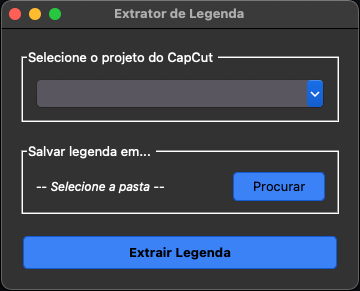

# cap2srt_gui
Extrator de legenda do CapCut é um app para MacOS, usando como base o código do [netgian](https://github.com/netgian/capcut2srt.git)

### Como usar
1. Baixe o 
2. Abra o executável `Extrator_Legenda.Unix`
3. Selecione o projeto do CapCut que deseja usar como base _(é importante já ter gerado a legenda pelo CapCut)_
4. Selecione a pasta de saída e clique em "Extrair Legenda"
5. Se der tudo certo, você encontrará o arquivo `legenda.srt` na pasta escolhida

**→ Importante:** se algo der errado durante a execução, o app criará um arquivo chamado `app_extrair-legenda.log`, especificando o que deu errado. 

Se precisar de ajuda, é só [entrar em contato](mailto:jeloytza@gmail.com). :)
